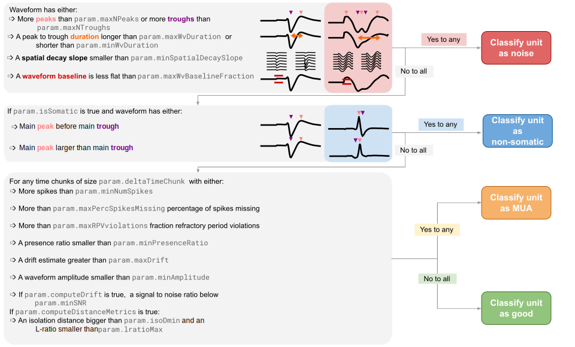

# 💣 BombCell: find bombshell cells! 💣

Manual curation of electrophysiology spike sorted units is slow, laborious, and hard to standardize and reproduce. Bombcell is a powerful toolbox that addresses this problem. It programatically evaluates the quality of recorded units and also extract essential electrophysiological properties.

Bombcell is specifically tailored for units recorded with Neuropixels probes (3A, 1.0, and 2.0) using SpikeGLX or OpenEphys and spike-sorted with Kilosort. If you want to use bombcell in conjunction with another spike sorting algorithm, please raise a [github issue](https://github.com/Julie-Fabre/bombcell/issues), create a [pull request](https://docs.github.com/en/pull-requests/collaborating-with-pull-requests/proposing-changes-to-your-work-with-pull-requests/creating-a-pull-request), or email [us](mailto:julie.mfabre@gmail.com).

### 📔 Bombcell wiki

Documentation and guides to using and troubleshooting bombcell can be found on the dedicated [wiki](https://github.com/Julie-Fabre/bombcell/wiki).

### 🏗️ Summary flow chart

### 🏁 Quick start guide

#### Overview

Bombcell extracts relevant quality metrics to categorize units into four categories: single somatic units, multi-units, noise units and non-somatic units.

Take a look at [`bc_qualityMetrics_pipeline`](https://github.com/Julie-Fabre/bombcell/blob/master/bc_qualityMetrics_pipeline.m) to see an example workflow.

#### Installation

To begin using Bombcell:
- [clone](https://docs.github.com/en/repositories/creating-and-managing-repositories/cloning-a-repository) the [repository](https://github.com/Julie-Fabre/bombcell/bombcell) and the [dependancies](#Dependancies).
- add bombcell's and the dependancies' folders to [MATLAB's path](https://uk.mathworks.com/help/matlab/ref/pathtool.html).
- in addition, if you want to compute ephys properties, change your working directory to `bombcell\ephysProperties\helpers` in matlab and run `mex -O CCGHeart.c` to able to compute fast ACGs, using a script written by Michaël Zugaro.

#### Dependancies

- https://github.com/kwikteam/npy-matlab (to load .npy data in).
- If you have z-lib compressed ephys data, compressed with [mtscomp](https://github.com/int-brain-lab/mtscomp), you will additionally need the [zmat toolbox](https://uk.mathworks.com/matlabcentral/fileexchange/71434-zmat). More information about compressing ephys data [here](https://www.biorxiv.org/content/biorxiv/early/2023/05/24/2023.05.22.541700.full.pdf?%3Fcollection=). 
- to compute fast ACGs, we use a function written by Michaël Zugaro, and it is already included in bombcell.

### 🤗 Support and citing

Please note that Bombcell is currently unpublished (manuscript under preparation). If you find Bombcell useful in your work, we kindly request that you cite:

> Julie M.J. Fabre, Enny H. van Beest, Andrew J. Peters, Matteo Carandini, & Kenneth D. Harris. (2023). Bombcell: automated curation and cell classification of spike-sorted electrophysiology data. Zenodo. https://doi.org/10.5281/zenodo.8172821

### :page_facing_up: License

Bombcell is under the open-source [copyleft](https://www.gnu.org/licenses/copyleft.en.html) [GNU General Public License 3](https://www.gnu.org/licenses/gpl-3.0.html). You can run, study, share, and modify the software under the condition that you keep and do not modify the license.

### 📬 Contact us

If you run into any issues or if you have any suggestions, please raise a [github issue](https://github.com/Julie-Fabre/bombcell/issues), create a [pull request](https://docs.github.com/en/pull-requests/collaborating-with-pull-requests/proposing-changes-to-your-work-with-pull-requests/creating-a-pull-request), or alternatively email [us](mailto:julie.mfabre@gmail.com).
