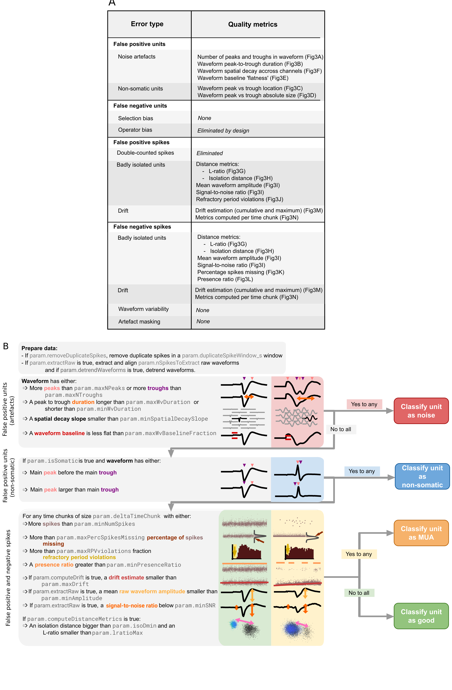

# 💣 Bombcell: find bombshell cells! 💣 
<picture>
  <source media="(prefers-color-scheme: light)" srcset="./docs/images/bombcell_logo_crop.svg"  width="40%" title="bombcell" alt="bombcell" align="right" vspace = "20">
  <source media="(prefers-color-scheme: dark)" srcset="./docs/images/bombcell_logo_crop_DARK.svg" width="40%" title="bombcell" alt="bombcell" align="right" vspace = "20">
  
</picture>

Manual curation of electrophysiology spike sorted units is slow, laborious, and hard to standardize and reproduce. Bombcell is a powerful toolbox that addresses this problem, evaluating the quality of recorded units and extracting essential electrophysiological properties. Bombcell can replace manual curation or can be used as a tool to aid manual curation. See [this talk](https://youtu.be/CvXUtGzkXIY?si=lHkLN885OCb4WJEv) at the annual Neuropixels course about quality control.

📢 We are working on a Python version - it's expected to be ready for release in April 📢

Please star the project to support us, using the top-right "⭐ Star" button.

### 📔 Bombcell wiki

Documentation and guides to using and troubleshooting bombcell can be found on the dedicated [wiki](https://github.com/Julie-Fabre/bombcell/wiki).

### 🔍️ How bombcell works

Below is a flowchart of how bombcell evaluates and classifies each unit:

### 🏁 Quick start guide

#### Overview

Bombcell extracts relevant quality metrics to categorize units into four categories: single somatic units, multi-units, noise units and non-somatic units.

Take a look at the MATLAB live script [`gettingStarted`](https://github.com/Julie-Fabre/bombcell/blob/main/gettingStarted.mlx) to see an example workflow and play around with our small toy dataset. You can also take a look at the exercise we prepared for the 2024 Neuropixels course [here](https://github.com/BombCell/Neuropixels_course_2024). 

#### Installation

Bombcell requires MATLAB>=2019a.

To begin using Bombcell:
- [clone](https://docs.github.com/en/repositories/creating-and-managing-repositories/cloning-a-repository) the [repository](https://github.com/Julie-Fabre/bombcell/bombcell) and the [dependencies](#Dependencies). You can do this either via git/GitHub desktop or directly by downloading the .zip file and decompressing it. 
- add bombcell's and the dependancies' folders to [MATLAB's path](https://uk.mathworks.com/help/matlab/ref/pathtool.html).
- in addition, if you want to compute ephys properties, change your working directory to `bombcell\+bc\+ep\+helpers` in matlab and run `mex -O CCGHeart.c` to able to compute fast ACGs, using part of the [FMAToolbox](https://fmatoolbox.sourceforge.net/).

#### Dependencies

- [npy-matlab](https://github.com/kwikteam/npy-matlab), to load .npy data in.
- If you have z-lib compressed ephys data, compressed with [mtscomp](https://github.com/int-brain-lab/mtscomp), you will need the [zmat toolbox](https://uk.mathworks.com/matlabcentral/fileexchange/71434-zmat). More information about compressing ephys data [here](https://www.biorxiv.org/content/biorxiv/early/2023/05/24/2023.05.22.541700.full.pdf?%3Fcollection=).
- [prettify-matlab](https://github.com/Julie-Fabre/prettify_matlab), to make plots pretty.
- MATLAB toolboxes:
    - Signal Processing Toolbox
    - Image Processing Toolbox
    - Statistics and Machine Learning Toolbox
    - Parallel Computing Toolbox
    - Optimization Toolbox

In addition we would like to acknowledge:
- to compute fast ACGs, we use a function (`CCGHeart.c`) part of the [FMAToolbox](https://fmatoolbox.sourceforge.net/), and it is already included in bombcell.
- to read in spikeGLX meta data, we use a function from Jennifer Colonell's [SpikeGLX_Datafile_Tools](https://github.com/jenniferColonell/SpikeGLX_Datafile_Tools) repository. 

### 🤗 Support and citing

If you find Bombcell useful in your work, we kindly request that you cite:

> Julie M.J. Fabre, Enny H. van Beest, Andrew J. Peters, Matteo Carandini, & Kenneth D. Harris. (2023). Bombcell: automated curation and cell classification of spike-sorted electrophysiology data. Zenodo. https://doi.org/10.5281/zenodo.8172821

### :page_facing_up: License

Bombcell is under the open-source [copyleft](https://www.gnu.org/licenses/copyleft.en.html) [GNU General Public License 3](https://www.gnu.org/licenses/gpl-3.0.html). You can run, study, share, and modify the software under the condition that you keep and do not modify the license.

### 📬 Contact us

If you run into any issues or if you have any suggestions, please raise a [github issue](https://github.com/Julie-Fabre/bombcell/issues) or create a [pull request](https://docs.github.com/en/pull-requests/collaborating-with-pull-requests/proposing-changes-to-your-work-with-pull-requests/creating-a-pull-request). You can also use the [Neuropixels slack workgroup](https://join.slack.com/t/neuropixelsgroup/shared_invite/zt-2h3sp1nfr-JZrpKWxeVptI0EPbHAoxKA).
Please star the project to support us, using the top-right "⭐ Star" button.
