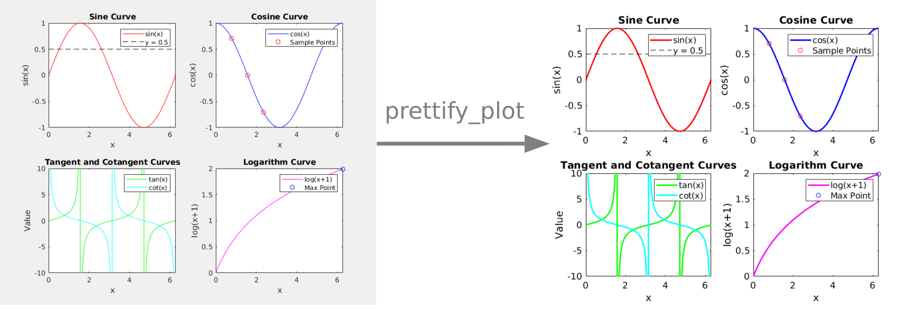

# 🪄 prettify matlab
Functions to instantly make your MATLAB scripts and plots beautiful and publication-ready.

## :triangular_flag_on_post: Features 

### Prettify plots 

Run `prettify_plot;` to prettify your current figure (includes all subplots). Includes options to modify the background color, text size and homogenize x and y limits across plots. 

### Prettify code

Run `prettify_current_code;` to prettify your current script open in the MATLAB editor. Prettify rules are stored in the `formatRules.xml` file. 

## 🏁 Installation

To use prettify_matlab:

- clone the repository
- add the repository folder to MATLAB's path.

prettify_matlab doesn't use any of MATLAB's add-on toolboxes and doesn't have any dependancies. 

P.S. It's prettify m*a*tlab, not prettify matl**aaaaaa**b 
