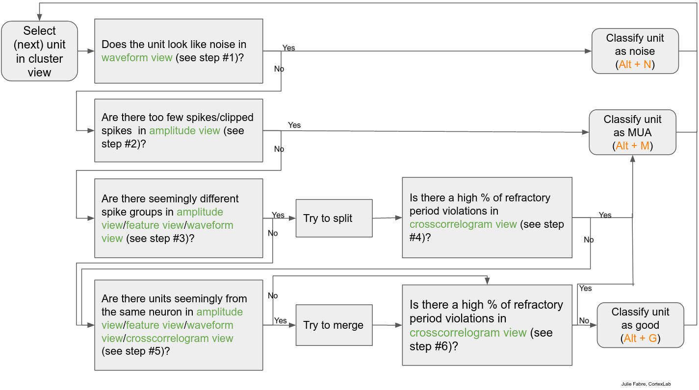

# An example manual curation workflow in phy

## Detailed workflow

#### Step # 1: Is the cluster noise?

Consider waveform view (tip: toggle template and waveform using 'w' and 'm'),
 is the waveform 'cell-like'?
    Note: sometimes, a waveform can have an odd shape because either (1) another cluster on the same channels almost always fires with this cluster (looking at trace view can help determine whether this is the case) (2) this cluster contains two cells, that need to be split (3) some noise “spikes” are contained in this cluster. In (2) and (3), trying to split the cluster can help (see step 3).
 is there spatial decay of the waveform amplitude across channels?
(optional, to remove non-somatic spikes), does the waveform peak precede the waveform trough?
If YES to any, label as noise (Alt+N) and move to next cluster.
If NO, continue to step 2.

#### Step #2: Is the cluster clearly MUA?

Consider amplitude view: are the amplitudes low, and seem clipped off? (tip: looking at the side histogram of amplitude distributions helps to evaluate how many spikes are clipped off)
 Are there very few spikes?
If YES to any, label as MUA (Alt+M) and move to next cluster.
If NO, continue to step 3.

#### Step #3: Should the cluster be split?

Consider amplitude view, feature view, waveform view: are there seemingly different spike groups in any of these? (tip: use ‘w’ to see raw waveforms)
If YES, try split using ‘Ctrl + left’ click to draw a polygon around cluster, then pressing ‘k’ if you are happy with the split. Use ‘Ctrl-Z’ to go back if you’re unhappy. Splitting should generally decrease the number of refractory period violations in crosscorrelogram view, unless the clusters split are present in non-overlapping times in the recording.

#### Step #4: Is the cluster clearly MUA after splitting?

Consider crosscorrelogram view: are there a lot of refractory period violations relative to the baseline firing rate (horizontal line)? (tip: set bin size to 0.5ms, refractory period lines to 2ms and window size to 50ms by typing ‘:cb 0.1’, ‘:cr 2’ and ‘:cw 50’)
If YES, label as MUA (Alt+M) and move to next cluster.
If NO, continue to step 5.

#### Step #5: Should the cluster be merged?

Select next ~10 most similar clusters (MSC) (‘space’ to select next most similar, and ‘shift + click’ in similarity view to select several at the same time).
- Do any MSCs appear to drift into current cluster in amplitude view?
- Do any MSCs appear to be n-th order burst spikes of current cluster? (similar but lower amplitude waveform, spikes at ~same time but lower amplitude, CCG with peak 1-3ms after)
- Do any MSCs have a similar waveform (‘o’ to overlap waveforms) in waveform view, overlap in feature view AND have similar CCGs in crosscorrelogram view?
If YES to any of these three scenarios, try to merge by pressing ‘g’. Use ‘Ctrl-Z’ to go back if you’re unhappy. Merging should generally not increase refractory period violations in crosscorrelogram view.

#### Step #6: Final cluster assessment

In crosscorrelogram view, are there few of refractory period violations relative to the baseline firing rate (horizontal line)?
If YES,  label as good (Alt+G) and move to next cluster.
If NO, label as MUA (Alt+M) and move to next cluster.

## Workflow flowchart

## Examples

#### Good waveforms

#### Bad waveforms

