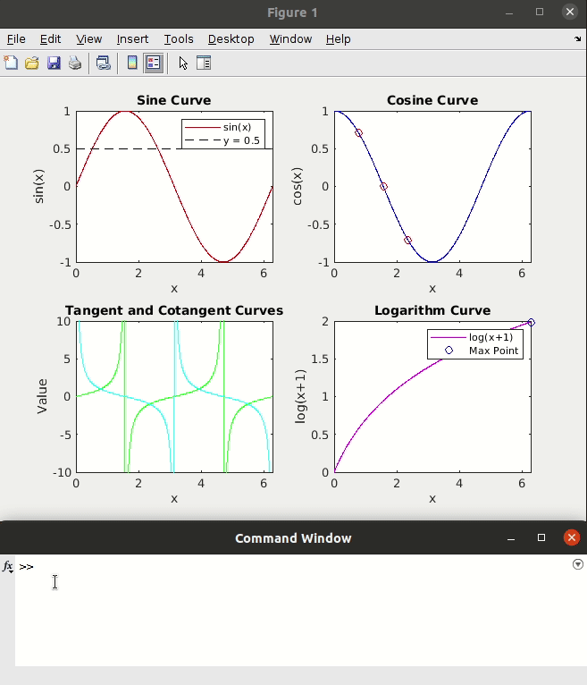

# 🪄 prettify matlab
A one-stop shop to instantly make your MATLAB scripts and plots beautiful, publication-ready and colorblind friendly.

## 🏁 Installation

To use prettify_matlab:

- clone the repository and it's dependancies 
- add the repository folder to MATLAB's path.

prettify_matlab doesn't use any of MATLAB's add-on toolboxes.

### Dependencies 

- [colorbrewer](https://github.com/DrosteEffect/BrewerMap), to generate colormaps 

- [rgb](https://uk.mathworks.com/matlabcentral/fileexchange/1805-rgb-m) - modified version (called with `prettify_rgb()`) already included. 

## :triangular_flag_on_post: Features     

### Prettify code

Run `prettify_current_code;` to prettify your current script open in the MATLAB editor. All code editing rules are stored in the `formatRules.xml` file, where they can easily be changed.

### Prettify plots

Run `prettify_plot;` to prettify your current figure (includes all subplots). Includes options to modify the background color, text size and homogenize x and y limits across plots. 

### Prettify colors
#### Colorblind simulator 
Run `prettify_colorblind_simulator;` to plot your current figure as it would seen with different types of color blindness.
Uses the matrices from:  
> Gustavo M. Machado, Manuel M. Oliveira, and Leandro A. F. Fernandes "A Physiologically-based Model for Simulation of Color Vision Deficiency". IEEE Transactions on Visualization and Computer Graphics. Volume 15 (2009), Number 6, November/December 2009. pp. 1291-1298.

#### To do list 
- [ ] Perceptually-uniform, colorblind friendly colormaps.
- [ ] Prettify colorbars and labels
- [ ] Add pvalue bars above plots 
- [ ] wrap titles/labels 
- [ ] bar plots, violin plots 
- [ ] shaded, shaded gradual 

